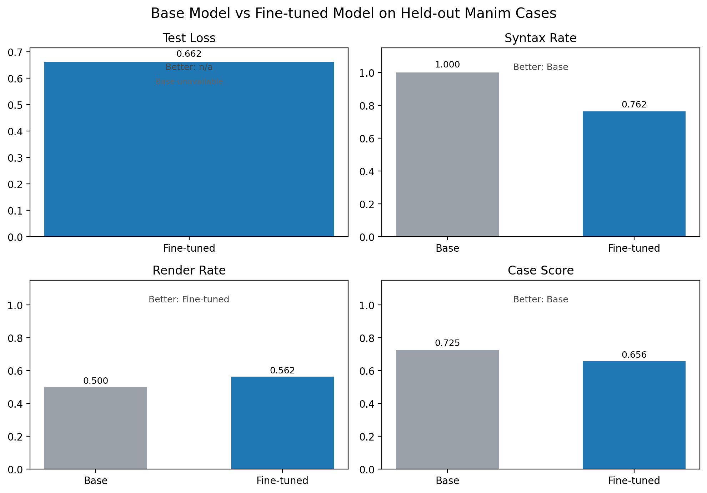

# autoresearch_manim_finetune

This fork keeps Karpathy's `program.md`-driven research loop, but swaps the CUDA-only baseline for a Mac-friendly MLX LoRA pipeline aimed at **Manim code generation**. The goal is not generic next-token loss on web text. The goal is a small open-source coding model that gets better at producing runnable, stylistically clean Manim scenes on Apple Silicon.

The repo now has two paths:

- `mac_pipeline/`: the active Apple Silicon fine-tuning workflow using `mlx-lm` and a Manim-specific evaluation harness.
- `prepare.py` / `train.py`: the upstream CUDA experiment baseline, kept here as reference only.

## What This Pipeline Optimizes

Each run trains a LoRA adapter on a curated Manim dataset and evaluates it on:

- held-out `test_loss` from the same high-quality dataset
- syntax validity
- scene-class detection
- required / forbidden snippet checks
- optional real Manim render success

That gives you the fast metric you asked for, `test_loss`, while still catching the common failure mode where a model gets lower loss but worse at actually producing runnable scenes.

## Recommended Starting Point on Your Machine

For an Apple Silicon laptop, start with:

- Base model: `Qwen/Qwen2.5-Coder-3B-Instruct`
- Fine-tuning: LoRA
- Evaluation: loss first, render pass rate as guardrail
- Dataset strategy: curated seed cases first, synthetic expansion second

On a 36 GB M4 Max, a 3B model is the right baseline for fast A/B iteration. Move to a larger code model only after the dataset and eval loop are stable.

## Mac Setup

Requirements:

- Apple Silicon Mac
- Python 3.13+
- [uv](https://docs.astral.sh/uv/)
- Homebrew packages for Manim rendering

```bash
brew install pkg-config cairo pango ffmpeg
uv sync
```

## Quick Start

Refresh the official-docs seed set:

```bash
uv run python -m mac_pipeline.cli import-doc-seeds \
  --manifest data/manim_docs_sources.json \
  --output data/manim_docs_seed_cases.jsonl

uv run python -m mac_pipeline.cli import-doc-seeds \
  --manifest data/manim_docs_feature_sources.json \
  --output data/manim_docs_feature_cases.jsonl
```

Rebuild the single canonical dataset file:

```bash
uv run python scripts/rebuild_canonical_dataset.py
```

Import external example repositories and split them into plain-Manim candidates versus custom-library conversion candidates:

```bash
uv run python -m mac_pipeline.cli import-repo-examples \
  --manifest data/manim_repo_sources.json \
  --output data/manim_repo_raw_candidates.jsonl \
  --metadata artifacts/repo_ingest/metadata.json

uv run python -m mac_pipeline.cli filter-repo-candidates \
  --input data/manim_repo_raw_candidates.jsonl \
  --plain-output data/manim_repo_plain_candidates.jsonl \
  --custom-output data/manim_repo_custom_candidates.jsonl \
  --summary artifacts/repo_ingest/filter_summary.json
```

Build the train/valid/test splits from the seed dataset:

```bash
uv run python -m mac_pipeline.cli build-dataset \
  --config configs/m4_max_qwen25coder_3b.json
```

Run one baseline fine-tuning experiment end-to-end:

```bash
uv run python -m mac_pipeline.cli run \
  --config configs/m4_max_qwen25coder_3b.json
```

Install the lightweight git hook that refreshes the comparison figure from the local eval JSONs before each commit:

```bash
./scripts/install_hooks.sh
```

Re-run evaluation only after you already have adapter weights:

```bash
uv run python -m mac_pipeline.cli eval \
  --config configs/m4_max_qwen25coder_3b.json
```

Compare two evaluation outputs:

```bash
uv run python -m mac_pipeline.cli compare \
  --config configs/m4_max_qwen25coder_3b.json \
  --baseline artifacts/evals/baseline.json \
  --candidate artifacts/evals/candidate.json \
  --output artifacts/evals/ab_result.json
```

Build a blind A/B review session from two eval outputs, render both sides into browser-playable videos, and launch the local review app:

```bash
uv run python -m mac_pipeline.cli build-review-session \
  --left artifacts/evals/m4-max-qwen25coder-3b-base-v2.json \
  --right artifacts/evals/m4-max-qwen25coder-3b.json \
  --output-dir artifacts/reviews/base-vs-finetuned

uv run python -m mac_pipeline.cli serve-review-app \
  --session-dir artifacts/reviews/base-vs-finetuned
```

- The review app keeps the model mapping hidden and shows only `Option A` / `Option B`.
- Ratings are appended to `artifacts/reviews/<session>/ratings.jsonl`.
- Verdicts support `A`, `B`, `both_good`, `both_bad`, and `skip`, which lets you preserve both positive and negative training signal.

Render a staged candidate shard for manual review without merging it into the canonical training dataset:

```bash
uv run python -m mac_pipeline.cli render-review-candidates \
  --input data/manim_review_candidates_round1.json \
  --output-dir artifacts/review_candidate_renders/round1
```

- `data/manim_review_candidates_round1.json` is a staging shard of new synthetic samples kept outside `data/manim_dataset.jsonl` until you explicitly promote the winners.
- The render command writes per-case videos plus `summary.json` so you can quickly see which candidates survived a real Manim pass.

Build a single-sample curation session when you want to rate dataset examples directly instead of comparing two model outputs:

```bash
uv run python -m mac_pipeline.cli build-sample-review-session \
  --input data/manim_review_candidates_round1.json \
  --output-dir artifacts/reviews/candidate-round1-curation

uv run python -m mac_pipeline.cli serve-review-app \
  --session-dir artifacts/reviews/candidate-round1-curation
```

- This mode shows one rendered sample at a time and records `promote`, `reject`, or `skip`.
- Use this for dataset curation, not model-vs-model evaluation.
- The resulting `ratings.jsonl` can be passed straight into `promote-review-candidates`.
- Add `--exclude-review path/to/ratings.jsonl` one or more times to build the next batch from only unreviewed samples.

Apply review decisions from a canonical-dataset audit batch:

```bash
uv run python -m mac_pipeline.cli apply-dataset-review-decisions \
  --review artifacts/reviews/dataset-curation-batch-001/ratings.jsonl
```

- `promote` keeps a case in the canonical dataset and logs the decision.
- `reject` removes the case from `data/manim_dataset.jsonl`, archives it into `data/manim_review_rejected.jsonl`, and logs the decision in `data/manim_review_decisions.jsonl`.
- `skip` is intentionally left unapplied so you can revisit those samples later.

Promote approved candidates into the canonical dataset after review:

```bash
uv run python -m mac_pipeline.cli promote-review-candidates \
  --input data/manim_review_candidates_round1.json \
  --review artifacts/reviews/candidate_decisions.jsonl
```

- The review file can be JSONL or a JSON array and must include `case_id` plus a decision-like field such as `decision`, `label`, `verdict`, or `rating`.
- Decisions `promote`, `approved`, `approve`, `keep`, `good`, and `winner` are treated as approval.
- Approved cases are appended to `data/manim_review_promoted.jsonl`, removed from the candidate shard by default, and `data/manim_dataset.jsonl` is rebuilt automatically.

Create a figure comparing the base model and the fine-tuned adapter:

```bash
uv run python -m mac_pipeline.cli plot-comparison \
  --baseline artifacts/evals/m4-max-qwen25coder-3b-base.json \
  --finetuned artifacts/evals/m4-max-qwen25coder-3b.json \
  --output docs/figures/base-vs-finetuned.png
```

## Project Layout

```text
mac_pipeline/                 MLX fine-tuning, evaluation, and A/B tooling
configs/m4_max_qwen25coder_3b.json
                              Baseline experiment config for Apple Silicon
data/manim_seed_cases.json    Hand-written starter dataset
data/manim_docs_sources.json  Official docs example manifest
data/manim_docs_seed_cases.jsonl
                              Imported official docs examples
data/manim_docs_feature_cases.jsonl
                              Imported official docs examples focused on feature coverage
data/manim_dataset.jsonl      Canonical training dataset used by experiment configs
data/manim_converted_cases.jsonl
                              Plain-Manim ML and chemistry conversions inspired by MIT repos
data/manim_converted_cases_round3.json
                              Additional converted ML and chemistry gold cases
data/manim_animation_cases.json
                              Animation-focused gold cases derived from official docs APIs and guides
data/manim_coverage_expansion_cases.json
                              Additional coverage cases for underrepresented Manim APIs like polar plots, zoomed scenes, tables, stream lines, and braces
data/manim_feature_fusion_cases.json
                              Derived gold cases that fuse multiple Manim features into one scene
data/manim_longform_cases.json
                              Curated 30s and 50s long-form scenes with richer animation structure
data/manim_composite_longform_cases.json
                              Composite long-form scenes that stitch multiple Manim APIs into one coherent walkthrough
data/manim_targeted_composite_cases.json
                              Targeted composite scenes for weak spots like camera motion, 3D walkthroughs, stream lines, and graph-table hybrids
data/manim_targeted_composite_variations.json
                              Variations on the targeted composite patterns so the model sees the same API families in multiple scene choreographies
data/manim_underrepresented_longform_cases.json
                              Longer animation-heavy cases that specifically patch still-underrepresented areas like complex-plane reasoning and boolean geometry
data/manim_underrepresented_group_cases_round2.json
                              Additional underrepresented long-form cases for rare APIs like LinearTransformationScene, ImplicitFunction, and Code-based walkthroughs
data/manim_physics_expansion_cases_round2.json
                              Additional physics long-form scenes covering optics, damped oscillation phase portraits, and magnetic flux walkthroughs
data/manim_3b1b_style_cases.json
                              Style-inspired explanatory math scenes that mimic 3Blue1Brown pacing and reveal structure while staying native to Manim Community Edition
data/manim_review_guided_expansion_cases.json
                              Review-informed gold cases derived from manual ranking notes, emphasizing readable overlays, centered end states, and less cluttered multi-beat compositions
data/manim_review_guided_expansion_cases_round2.json
                              A second review-informed shard focused on corrected weak concepts such as aliasing, compound growth, probability-to-density transitions, and cleaner field or orbital explanations
data/manim_repo_sources.json  GitHub repo source manifest
data/manim_repo_raw_candidates.jsonl
                              Imported repo-derived scene candidates
data/manim_repo_plain_candidates.jsonl
                              Plain-Manim repo candidates that are near-trainable
data/manim_repo_custom_candidates.jsonl
                              Repo candidates that require custom-library conversion
program.md                    Autoresearch loop instructions for the agent
results.tsv                   Run log for keep / discard decisions
prepare.py, train.py          Legacy upstream CUDA baseline
```

## Dataset Guidance

The bootstrap dataset is intentionally small. It is there to bootstrap the loop, not to finish the job.

Good next expansions:

1. Add your own known-good Manim scenes first.
2. Import more official Manim examples through `data/manim_docs_sources.json`.
3. Create prompt variants around the same concept without changing correctness criteria.
4. Add hard evaluation-only prompts that never enter training.
5. Keep prompts concrete: scene objective, visual constraints, and required constructs.
6. Prefer short, correct, idiomatic scenes over flashy long ones.

Current dataset structure:

- `ManimML` and `manim-Chemistry` are both MIT-licensed.
- The canonical dataset is a single file with metadata tags such as `tier:gold`, `tier:silver`, `source:*`, and duration buckets like `duration:5s`.
- The dataset now also includes explicit `duration:30s` and `duration:50s` cases for longer multi-beat scenes, not just short clips.
- Recent long-form additions intentionally cover moving-camera calculus, vector-field flow, 3D surface orbit, and dynamic-programming table-fill patterns so the model sees richer multi-step scene logic.
- Composite long-form cases deliberately combine multiple APIs like trackers, tables, traced paths, residual-style flow diagrams, and staged captions inside one scene class so the model sees longer coherent walkthroughs without training on raw multi-scene files.
- A separate targeted composite layer now pushes specifically on camera motion, 3D surface walkthroughs, stream-line explanations, and graph-table hybrids where the model has recently struggled.
- Additional targeted variations reuse those same weak API families with different pacing and layouts so the model does not only memorize one canonical template for each hard pattern.
- Underrepresented long-form cases are added as their own source layer so rare but important APIs such as `ComplexPlane` and boolean geometry operations can be expanded without bloating the more general curated files.
- A second underrepresented shard now adds rare workflow-oriented APIs such as `LinearTransformationScene`, `ImplicitFunction`, and `Code` so those patterns are present in longer explanatory scenes too.
- A dedicated follow-up physics shard adds broader subject coverage beyond fluid flow, including optics, damped mechanical motion, and electromagnetism.
- A dedicated 3b1b-style source layer captures progressive reveal, basis-vector reasoning, secant-to-tangent narration, and discrete-to-continuous visual storytelling patterns without copying the original video code.
- A review-guided source layer turns manual ranking notes into new gold cases by reinforcing readable overlays, fixed-frame 3D labels, centered summaries, and cleaner one-concept pacing.
- Canonical dataset rebuilds now skip any case ids archived in `data/manim_review_rejected.jsonl`, so adding new source shards does not resurrect samples you already rejected in review.
- Experiment configs can filter by tags without forking the dataset file.
- Repo-derived plain-Manim examples stay inside the same dataset and are tagged `tier:silver` instead of being stored as a separate training corpus.
- Source manifests and import outputs remain in `data/` for provenance and rebuilds, but `data/manim_dataset.jsonl` is the only dataset file the experiment configs should point at.

OpenRouter frontier benchmark:
```bash
export OPENROUTER_API_KEY=...
uv run python -m mac_pipeline.cli benchmark --config configs/openrouter_frontier_benchmark.json
```

- The benchmark uses the same held-out `test.jsonl` split as the local eval pipeline and writes one JSON file per target plus a leaderboard to `artifacts/benchmarks/openrouter-frontier/`.
- The default benchmark lineup in [openrouter_frontier_benchmark.json](/Users/sebastianboehler/Documents/GitHub/autoresearch_manim_finetune/configs/openrouter_frontier_benchmark.json) compares the local base model, the local fine-tuned adapter, and OpenRouter-hosted Claude frontier models on identical prompts and scoring rules.
- OpenRouter requests use the official `chat/completions` API endpoint with OpenAI-style `messages`. `HTTP-Referer` and `X-Title` are configurable in the benchmark config for attribution.
- Remote benchmark runs will incur API cost. Keep `evaluation.max_cases` small while iterating on the pipeline.

## Using the Karpathy Loop

Point your coding agent at `program.md`. The adapted loop treats:

- held-out loss as the primary fast metric
- render success and case score as regression checks
- config / dataset / prompt edits as the main levers, not architecture hacking in `train.py`

## Current Comparison

Below is the current direct comparison figure for the latest locally available base-vs-fine-tuned eval pair. If you install the repo hook above, the plot is refreshed automatically from the local eval JSONs before each commit.



Interpretation:

- The latest early-stopped run improved held-out loss compared with the overfit final-checkpoint run, but the base model still performs better on held-out render success and mean case score.
- The comparison inputs live in `artifacts/evals/m4-max-qwen25coder-3b-base-v2.json` and `artifacts/evals/m4-max-qwen25coder-3b.json`.
- The base-model loss is still `n/a` in the plot because `mlx_lm lora --test` requires an adapter path; the base comparison remains generation-based.
- Long-form curriculum experiments live in `configs/m4_max_qwen25coder_3b_with_longform.json` and `configs/m4_max_qwen25coder_3b_without_longform.json` so you can compare long-form mixing without forking the dataset.

## Notes

- `mlx-lm` and `manim` install on current Apple Silicon Python 3.13, but Manim still depends on the Homebrew system packages above.
- The default config now trains in 25-step chunks, saves numbered adapter checkpoints every chunk, and restores the best validation checkpoint after early stopping.
- All adapters and eval artifacts live under `artifacts/`, which is gitignored and will not be pushed to GitHub.
- If render checks are too slow early on, set `"run_render": false` in the config and use loss + static checks during inner-loop iteration.
- Once the dataset gets large enough, keep a strict held-out test set and avoid training on it indirectly through manual prompt tuning.

## License

MIT
