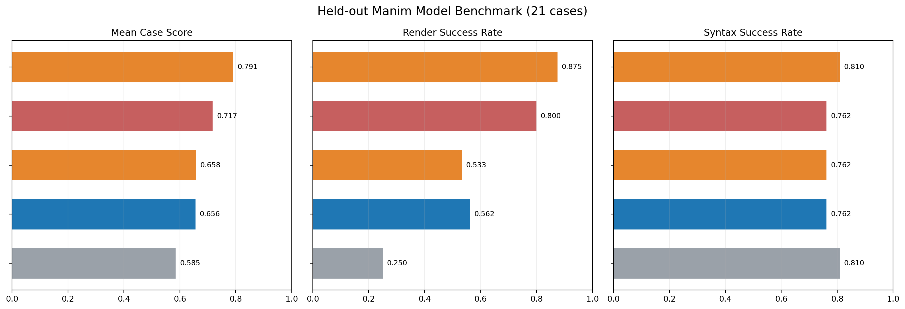

# Public Manim Benchmark

Generated on April 7, 2026 from the current 21-case held-out split. This page is the public snapshot of the repo's model-comparison benchmark.

## Leaderboard

| Rank | Model | Category | Case Score | Render Rate | Syntax Rate |
| --- | --- | --- | ---: | ---: | ---: |
| 1 | Xiaomi MiMo-V2-Pro | API model | 0.791 | 0.875 | 0.810 |
| 2 | Xiaomi MiMo-V2-Pro + Hermes Skill | API model + skill | 0.717 | 0.800 | 0.762 |
| 3 | MiniMax M2.7 | API model | 0.658 | 0.533 | 0.762 |
| 4 | Qwen 2.5 Coder 3B Fine-tuned | Local fine-tune | 0.656 | 0.562 | 0.762 |
| 5 | Qwen 2.5 Coder 3B Base | Local base | 0.585 | 0.250 | 0.810 |

## What This Measures

- Same held-out prompt set for local base, local fine-tune, and API models.
- Composite score over syntax validity, scene detection, required or forbidden snippet checks, and optional real Manim render success.
- API runs use ADK plus OpenRouter. Local runs use the repo's MLX evaluation pipeline.

## Current Read

- Xiaomi MiMo-V2-Pro currently leads the held-out benchmark with case score `0.791` and render rate `0.875`.
- The copied Hermes skill is not a free gain. It rescues isolated prompts, but it lowers Xiaomi's aggregate score and render rate on this split.
- MiniMax M2.7 lands near the local fine-tune on mean case score (`0.658` vs `0.656`), but it still trails Xiaomi on render reliability.
- The local fine-tune still wins select science-story prompts, so continuing fine-tuning only makes sense if local inference cost or offline deployment matters.

## Rendered Examples

### Transform Matching Shapes

All compared models render this prompt, which makes it a clean side-by-side quality comparison instead of an error showcase.

Prompt: `Create a short Manim scene that morphs one phrase into another using TransformMatchingShapes, so the animation emphasizes shared letter geometry rather than a simple fade.`

#### Xiaomi MiMo-V2-Pro

<video controls playsinline preload="metadata" poster="figures/benchmark_examples/anim-matching-shapes-word-morph-xiaomi-mimo-v2-pro.png" src="videos/benchmark_examples/anim-matching-shapes-word-morph-xiaomi-mimo-v2-pro.mp4"></video>

Status: `Rendered`. Score `0.917`. Render `1.000`. Syntax `1.000`.

#### Xiaomi MiMo-V2-Pro + Hermes Skill

<video controls playsinline preload="metadata" poster="figures/benchmark_examples/anim-matching-shapes-word-morph-xiaomi-mimo-v2-pro-hermes-skill.png" src="videos/benchmark_examples/anim-matching-shapes-word-morph-xiaomi-mimo-v2-pro-hermes-skill.mp4"></video>

Status: `Rendered`. Score `0.917`. Render `1.000`. Syntax `1.000`.

#### MiniMax M2.7

<video controls playsinline preload="metadata" poster="figures/benchmark_examples/anim-matching-shapes-word-morph-minimax-m2-7.png" src="videos/benchmark_examples/anim-matching-shapes-word-morph-minimax-m2-7.mp4"></video>

Status: `Rendered`. Score `0.917`. Render `1.000`. Syntax `1.000`.

#### Qwen 2.5 Coder 3B Fine-tuned

<video controls playsinline preload="metadata" poster="figures/benchmark_examples/anim-matching-shapes-word-morph-qwen-2-5-coder-3b-fine-tuned.png" src="videos/benchmark_examples/anim-matching-shapes-word-morph-qwen-2-5-coder-3b-fine-tuned.mp4"></video>

Status: `Rendered`. Score `0.917`. Render `1.000`. Syntax `1.000`.

### Square-To-Circle Primitive

A canonical docs-style scene where every shown model completes the same basic animation successfully.

Prompt: `Create a basic Manim scene that first draws a rotated square and then transforms it into a filled circle.`

#### Xiaomi MiMo-V2-Pro

<video controls playsinline preload="metadata" poster="figures/benchmark_examples/docs-square-to-circle-xiaomi-mimo-v2-pro.png" src="videos/benchmark_examples/docs-square-to-circle-xiaomi-mimo-v2-pro.mp4"></video>

Status: `Rendered`. Score `1.000`. Render `1.000`. Syntax `1.000`.

#### Xiaomi MiMo-V2-Pro + Hermes Skill

<video controls playsinline preload="metadata" poster="figures/benchmark_examples/docs-square-to-circle-xiaomi-mimo-v2-pro-hermes-skill.png" src="videos/benchmark_examples/docs-square-to-circle-xiaomi-mimo-v2-pro-hermes-skill.mp4"></video>

Status: `Rendered`. Score `1.000`. Render `1.000`. Syntax `1.000`.

#### MiniMax M2.7

<video controls playsinline preload="metadata" poster="figures/benchmark_examples/docs-square-to-circle-minimax-m2-7.png" src="videos/benchmark_examples/docs-square-to-circle-minimax-m2-7.mp4"></video>

Status: `Rendered`. Score `1.000`. Render `1.000`. Syntax `1.000`.

#### Qwen 2.5 Coder 3B Fine-tuned

<video controls playsinline preload="metadata" poster="figures/benchmark_examples/docs-square-to-circle-qwen-2-5-coder-3b-fine-tuned.png" src="videos/benchmark_examples/docs-square-to-circle-qwen-2-5-coder-3b-fine-tuned.mp4"></video>

Status: `Rendered`. Score `1.000`. Render `1.000`. Syntax `1.000`.

### Create Circle Primitive

A very small primitive scene that every shown model can render, making style and pacing differences easy to inspect.

Prompt: `Create a short Manim scene that draws a filled pink circle in the center of the frame using the basic Create animation.`

#### Xiaomi MiMo-V2-Pro

<video controls playsinline preload="metadata" poster="figures/benchmark_examples/docs-create-circle-xiaomi-mimo-v2-pro.png" src="videos/benchmark_examples/docs-create-circle-xiaomi-mimo-v2-pro.mp4"></video>

Status: `Rendered`. Score `0.917`. Render `1.000`. Syntax `1.000`.

#### Xiaomi MiMo-V2-Pro + Hermes Skill

<video controls playsinline preload="metadata" poster="figures/benchmark_examples/docs-create-circle-xiaomi-mimo-v2-pro-hermes-skill.png" src="videos/benchmark_examples/docs-create-circle-xiaomi-mimo-v2-pro-hermes-skill.mp4"></video>

Status: `Rendered`. Score `0.917`. Render `1.000`. Syntax `1.000`.

#### MiniMax M2.7

<video controls playsinline preload="metadata" poster="figures/benchmark_examples/docs-create-circle-minimax-m2-7.png" src="videos/benchmark_examples/docs-create-circle-minimax-m2-7.mp4"></video>

Status: `Rendered`. Score `1.000`. Render `1.000`. Syntax `1.000`.

#### Qwen 2.5 Coder 3B Fine-tuned

<video controls playsinline preload="metadata" poster="figures/benchmark_examples/docs-create-circle-qwen-2-5-coder-3b-fine-tuned.png" src="videos/benchmark_examples/docs-create-circle-qwen-2-5-coder-3b-fine-tuned.mp4"></video>

Status: `Rendered`. Score `0.917`. Render `1.000`. Syntax `1.000`.

### Labeled Bohr Diagram

A richer chemistry diagram where every shown model still produces a valid end-to-end render.

Prompt: `Create a 10-second Manim scene that explains a simplified Bohr model of carbon with a nucleus, two electron shells, and six electrons arranged around the shells. Label the shells and the atom name.`

#### Xiaomi MiMo-V2-Pro

<video controls playsinline preload="metadata" poster="figures/benchmark_examples/chem-bohr-carbon-diagram-xiaomi-mimo-v2-pro.png" src="videos/benchmark_examples/chem-bohr-carbon-diagram-xiaomi-mimo-v2-pro.mp4"></video>

Status: `Rendered`. Score `0.938`. Render `1.000`. Syntax `1.000`.

#### Xiaomi MiMo-V2-Pro + Hermes Skill

<video controls playsinline preload="metadata" poster="figures/benchmark_examples/chem-bohr-carbon-diagram-xiaomi-mimo-v2-pro-hermes-skill.png" src="videos/benchmark_examples/chem-bohr-carbon-diagram-xiaomi-mimo-v2-pro-hermes-skill.mp4"></video>

Status: `Rendered`. Score `0.938`. Render `1.000`. Syntax `1.000`.

#### MiniMax M2.7

<video controls playsinline preload="metadata" poster="figures/benchmark_examples/chem-bohr-carbon-diagram-minimax-m2-7.png" src="videos/benchmark_examples/chem-bohr-carbon-diagram-minimax-m2-7.mp4"></video>

Status: `Rendered`. Score `0.875`. Render `1.000`. Syntax `1.000`.

#### Qwen 2.5 Coder 3B Fine-tuned

<video controls playsinline preload="metadata" poster="figures/benchmark_examples/chem-bohr-carbon-diagram-qwen-2-5-coder-3b-fine-tuned.png" src="videos/benchmark_examples/chem-bohr-carbon-diagram-qwen-2-5-coder-3b-fine-tuned.mp4"></video>

Status: `Rendered`. Score `0.938`. Render `1.000`. Syntax `1.000`.

## Public Data Snapshot

A committed JSON snapshot for this page lives at `docs/data/model-benchmark-public.json`.
