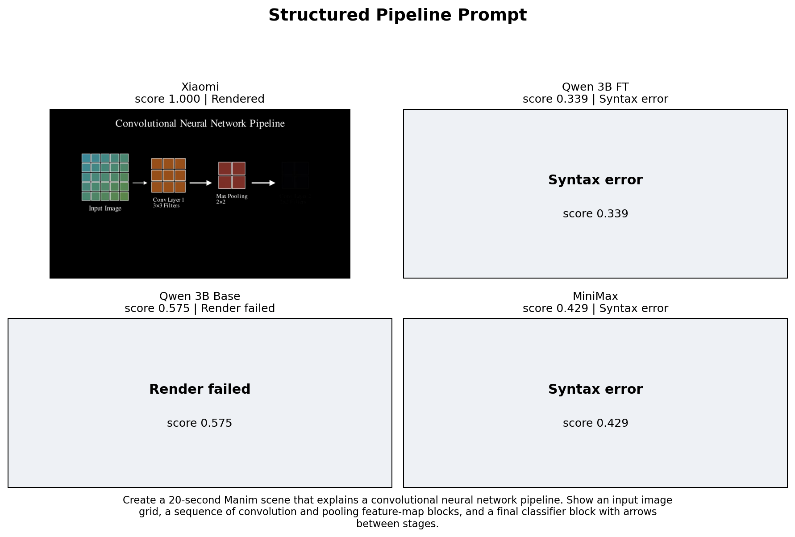
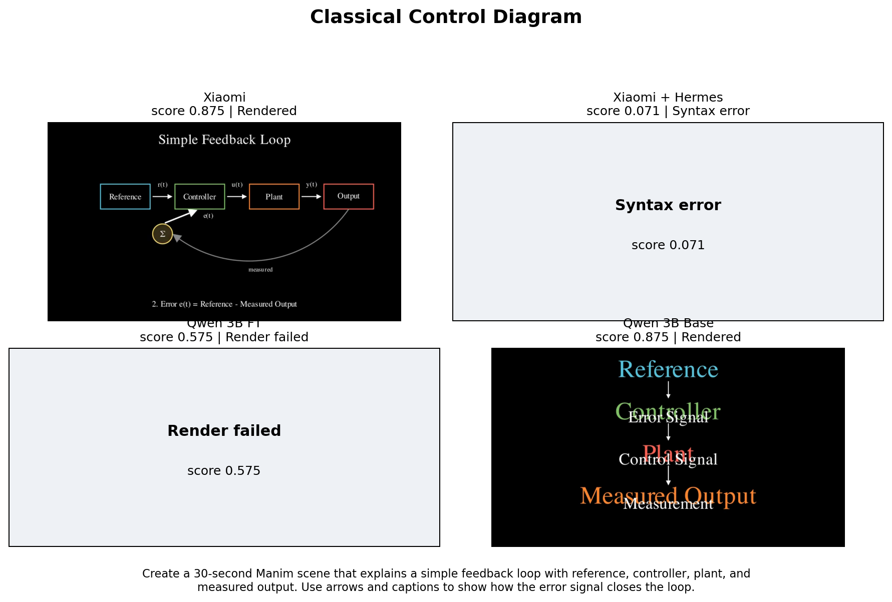
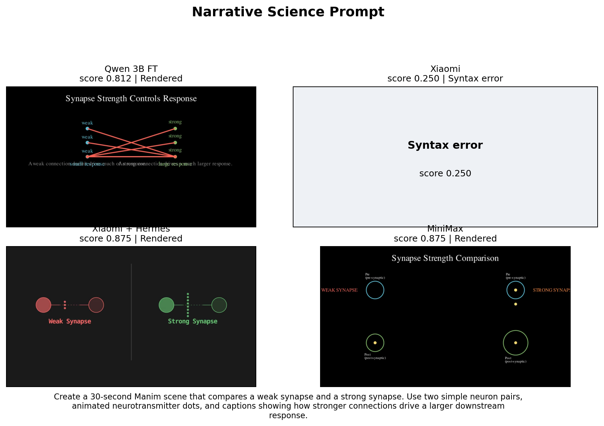
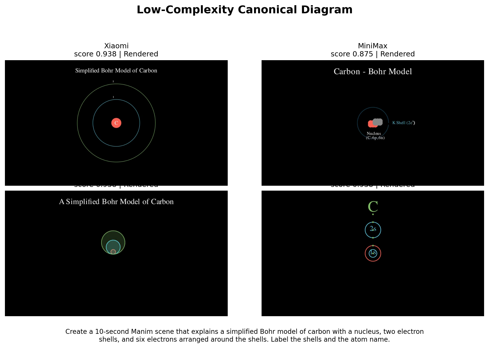

# Public Manim Benchmark

Generated on April 7, 2026 from the current 21-case held-out split. This page is the public snapshot of the repo's model-comparison benchmark.

## Leaderboard

| Rank | Model | Category | Case Score | Render Rate | Syntax Rate |
| --- | --- | --- | ---: | ---: | ---: |
| 1 | Xiaomi MiMo-V2-Pro | API model | 0.791 | 0.875 | 0.810 |
| 2 | Xiaomi MiMo-V2-Pro + Hermes Skill | API model + skill | 0.717 | 0.800 | 0.762 |
| 3 | MiniMax M2.7 | API model | 0.658 | 0.533 | 0.762 |
| 4 | Qwen 2.5 Coder 3B Fine-tuned | Local fine-tune | 0.656 | 0.562 | 0.762 |
| 5 | Qwen 2.5 Coder 3B Base | Local base | 0.585 | 0.250 | 0.810 |

## What This Measures

- Same held-out prompt set for local base, local fine-tune, and API models.
- Composite score over syntax validity, scene detection, required or forbidden snippet checks, and optional real Manim render success.
- API runs use ADK plus OpenRouter. Local runs use the repo's MLX evaluation pipeline.

## Current Read

- Xiaomi MiMo-V2-Pro currently leads the held-out benchmark with case score `0.791` and render rate `0.875`.
- The copied Hermes skill is not a free gain. It rescues isolated prompts, but it lowers Xiaomi's aggregate score and render rate on this split.
- MiniMax M2.7 lands near the local fine-tune on mean case score (`0.658` vs `0.656`), but it still trails Xiaomi on render reliability.
- The local fine-tune still wins select science-story prompts, so continuing fine-tuning only makes sense if local inference cost or offline deployment matters.

## Rendered Examples

### Structured Pipeline Prompt

A hard held-out explainer where only the leading API model produced a clean render.

Prompt: `Create a 20-second Manim scene that explains a convolutional neural network pipeline. Show an input image grid, a sequence of convolution and pooling feature-map blocks, and a final classifier block with arrows between stages.`

- Xiaomi MiMo-V2-Pro: Rendered, score `1.000`, render `1.000`, syntax `1.000`.
- Qwen 2.5 Coder 3B Fine-tuned: Syntax error, score `0.339`, render `n/a`, syntax `0.000`.
- Qwen 2.5 Coder 3B Base: Render failed, score `0.575`, render `0.000`, syntax `1.000`.
- MiniMax M2.7: Syntax error, score `0.429`, render `n/a`, syntax `0.000`.

### Classical Control Diagram

The base model can still match on some simple block-diagram prompts, while the Hermes skill hurt Xiaomi here.

Prompt: `Create a 30-second Manim scene that explains a simple feedback loop with reference, controller, plant, and measured output. Use arrows and captions to show how the error signal closes the loop.`

- Xiaomi MiMo-V2-Pro: Rendered, score `0.875`, render `1.000`, syntax `1.000`.
- Xiaomi MiMo-V2-Pro + Hermes Skill: Syntax error, score `0.071`, render `n/a`, syntax `0.000`.
- Qwen 2.5 Coder 3B Fine-tuned: Render failed, score `0.575`, render `0.000`, syntax `1.000`.
- Qwen 2.5 Coder 3B Base: Rendered, score `0.875`, render `1.000`, syntax `1.000`.

### Narrative Science Prompt

The local fine-tune still wins some prompts, which means the specialization path still has real signal.

Prompt: `Create a 30-second Manim scene that compares a weak synapse and a strong synapse. Use two simple neuron pairs, animated neurotransmitter dots, and captions showing how stronger connections drive a larger downstream response.`

- Qwen 2.5 Coder 3B Fine-tuned: Rendered, score `0.812`, render `1.000`, syntax `1.000`.
- Xiaomi MiMo-V2-Pro: Syntax error, score `0.250`, render `n/a`, syntax `0.000`.
- Xiaomi MiMo-V2-Pro + Hermes Skill: Rendered, score `0.875`, render `1.000`, syntax `1.000`.
- MiniMax M2.7: Rendered, score `0.875`, render `1.000`, syntax `1.000`.

### Low-Complexity Canonical Diagram

Simple canonical prompts are now close to solved across the stack, with only small quality differences.

Prompt: `Create a 10-second Manim scene that explains a simplified Bohr model of carbon with a nucleus, two electron shells, and six electrons arranged around the shells. Label the shells and the atom name.`

- Xiaomi MiMo-V2-Pro: Rendered, score `0.938`, render `1.000`, syntax `1.000`.
- MiniMax M2.7: Rendered, score `0.875`, render `1.000`, syntax `1.000`.
- Qwen 2.5 Coder 3B Fine-tuned: Rendered, score `0.938`, render `1.000`, syntax `1.000`.
- Qwen 2.5 Coder 3B Base: Rendered, score `0.938`, render `1.000`, syntax `1.000`.

## Unresolved Models

| Model | Status |
| --- | --- |
| Qwen 3.6 Plus Free | ADK did not return a final text response for model qwen/qwen3.6-plus:free. |
| NVIDIA Nemotron 3 Super 120B A12B Free | OpenRouter benchmark did not return a completed result after extended wait; run aborted. |

## Public Data Snapshot

A committed JSON snapshot for this page lives at `docs/data/model-benchmark-public.json`.
